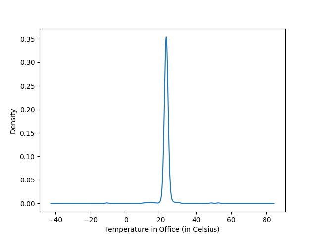

# Sensor Mini-Project 

Authors: McKenna Damschroder and Zongxin Cui

Date: 9/14/2020

## Responses

Becauses Tasks 0 through 3 had their own individual questions, these responses have been kept separate from the full report for neatness sake. Please see Task 4 below for the final written report. 

### Task 0:

What is the greeting string issued by the server to the client upon first connecting?

 - "ECE Senior Capstone IoT simulator"

### Task 1:

In this task, code was added to [src/sp_iotsim/client.py](https://github.com/zongxinc/2020-sensor-miniproject/blob/main/src/sp_iotsim/client.py) to save the JSON sensor data to a text file as it comes in. The resulting text file is named [data.txt](https://github.com/zongxinc/2020-sensor-miniproject/blob/main/data.txt).

### Task 2:

In this task, the Pandas library was used to do numerical analysis on the data set from Task 1. All analysis code can be found in [analysis.py](https://github.com/zongxinc/2020-sensor-miniproject/blob/main/analysis.py). The first three questions answered below involved analyzing sensor data for a specific room. The room that we chose to examine is the office.

1. What are the median and variance observed from the temperature data (in Celsius)? 

 - Median: 23.0187
 - Variance: 9.7901

2. What are the median and variance observed from the occupancy data?

 - Median: 2.0
 - Variance: 2.2173

3. Plot the probability density functions for each sensor type.

Below are the graphed probability density functions. Once again, this is solely for data taken from the office sensors. The plots below were created using Pandas's kde() function. This function generates Kernel Density Estimate (KDE) plots using Gaussian kernels. A KDE is a way, in statistics, to estimate the probability density function. We also have created histogram plots for each data set and they can be found in the [images](https://github.com/zongxinc/2020-sensor-miniproject/tree/main/images) folder. 

4. What is the mean and variance of the time interval of the sensor readings (in seconds)? Plot its probability density function. 

 - Mean: 1.0368927617675312
 - Variance: 1.0847226416405662
 
Below is the PDF for the time interval of the sensor readings. A histogram of this data can be found in the [images](https://github.com/zongxinc/2020-sensor-miniproject/tree/main/images) folder.

Does it mimic a well-known distribution for connection intervals in large systems?

Yes, this mimics what the distribution would look like for connection intervals in large systems. The majority of the time intervals fall in a narrow strip of small values. In our data, this would be in the 0-1 second range. Connections and messages would probably be expected to occur in this interval range. However, it is impossible for the data to be sent and received at an exact consistent time. For instance, if a server has many distinct clients, as is possible with our simulation, the nature of scheduling tasks might make it that some messages take longer for the server to send and/or the client to receive. Our time interval distribution may have more points deviated from the median than in actual systems, but in general, its shape mimics that of a well-known distribution.

### Task 3:

In order to detect anomalies in temperature sensor data, we implemented an algorithm that checks if a temperature data point is further than 2 standard deviations away from the mean. To be consistent with Task 2, we implemented this only looking at the temperature data from the office sensor. Our code for this task can be found in [analysis.py](https://github.com/zongxinc/2020-sensor-miniproject/blob/main/analysis.py). The anomalies detected in our data set using this algorithm can be found in [anomalies.txt](https://github.com/zongxinc/2020-sensor-miniproject/blob/main/anomalies.txt).

1. Find the percent of "bad" data points and determine the temperature median and variance with these bad data points discarded. Do this for the same room used in Task 2 (the office).

The percentage of all points that are bad points is: 1.729%

The new median and variance with the bad points removed are:

- Median: 23.0193
- Variance: 1.0824

2. Does a persistent change in temperature	always indicate a failed sensor?

A persistent change in temperature doesn't necessarily indicate a failed sensor. The sensor being faulty depends on the actual temperature reading obtained. If a persistent change occurs, and the sensor no longer gives readings in a range one could expect for its location, that is when one should examine the sensor. Outside factors must be taken into consideration when setting these parameters to avoid false negatives. 

3. What are possible bounds on temperature for each room type?

When deciding on temperature bounds for each room type, one must consider the normal expected temperatures for these locations, but also low-probability scenarios like broken heating or AC systems. Below are possible bounds for a temperature sensor for each room:

- Lab: 13 - 30 degrees Celsius
- Class: 15 - 30 degrees Celsius
- Office: 16 - 32 degrees Celsius 

### Task 4:

In this exercise, we ran a Python program to simulate a system of internet-connected sensors. It utilizes the websockets Python library to create a server that sends data packets with random timing to a client. These data packets hold “readings” from three different sensors measuring temperature, occupancy, and CO2 levels in three different rooms: the office, classroom 1, and lab 1. This base simulation was then expanded on in order to perform analysis on received data. This involved using the Pandas library to calculate medians, means, and variances and graphing probability density functions with data from the various sensors. An algorithm was also developed to find anomalies in the temperature data, and the analysis was repeated with the anomalies removed from the data set. All analysis results can be found in the above sections of this report.

The sensors mimicked in this simulation measure temperature, occupancy, and CO2. The server “receives” values from the sensors at random time intervals and sends them to attached clients using the Python websockets library. This is similar to a sensor system that you might see utilized in the real world. Large sensor systems reduce the need for manual monitoring and reduce labor and resource costs wherever applied. Schools and universities, for example, that have large buildings that largely remain vacant in summer months may rely on sensors to monitor temperature and CO2 levels. They can avoid having to place personnel in these buildings unnecessarily and instead, remotely monitor the data received from these sensors. They also might measure occupancy as a matter of security or to determine when air level adjustments are needed. The agriculture industry is another that benefits from large-scale sensor systems. They may use slightly different sensors, ones that detect soil moisture, air quality, and sunlight, for example, but the principle of data collection by a server that sends out to clients for monitoring is similar.

The simulation’s simplistic nature does leave it deficient in some areas, the most glaring of which is the method by which data is generated. Within the simulation, sensor data is randomly generated directly by the server and sent out at random time intervals. This fails to account for the complex process involved with monitoring the peripherals and receiving their data, which would most likely be implemented with interrupt processing. It also operates as though all sensors were synchronized. The server sends one time-stamped report with a temperature, occupancy, and CO2 reading. In a real-world application, sensors would be reporting data separately, and the server would be unable to process data from every single sensor in a room at the same moment. Lastly and most obviously, the simulation is a vast under-representation of the application of one of these systems. In every case except those with very narrow purposes, a sensor system such as this would have a scope vastly exceeding three sensors placed in each of three rooms. 

This simulation initially being written using Python websockets rather than with a compiled language may present some difficulties, the largest of which is runtime. Python is a scripting language that is interpreted and transformed into machine code by an interpreter. The interpreter itself executes the program, and all of this is initiated with a single command. A compiled language, however, such as C++, is separately compiled into machine code and then run as an executable. Additionally, Python and similar languages are interpreted line-by-line in sequence while it is being run, while C++ is compiled entirely at once before execution. The consequence of these differences is that a compiled program will complete in a shorter runtime than its equivalent written in a language like Python. A websocket simulation like this may especially feel the effects of this difference. A compiled program would most likely be faster at sending, receiving, and processing the sensor data.
	
If we were to attempt to translate this simulation into a fully realized system, something we would need to consider is the method in which the server receives data from the sensors. The two most common methods for executing this are polling and interrupt processing. Polling is a continuous process in which the server would repeatedly check each of the sensors for a flag, indicating it has new data to report. The server notices the flag, executes what it needs to in order to receive that data, and continues polling. It would cyclically move between each sensor, likely waiting a small amount of time between each cycle. This method is best used when the sensors are giving almost continuous data. However, if this is not the case and the server is repeatedly checking a sensor that has nothing to provide, power is being consumed unnecessarily and time is being wasted. In most cases, the better choice would be to use interrupts. If a system uses interrupt processing, a sensor lets the server know when it has data to report by sending an interrupt signal. This signal tells the server to stop program execution and run an interrupt service routine (IRS) to obtain the data. When the IRS is complete, the server continues execution of its program until it next receives a new interrupt signal. IRSs are usually small and efficient, and so data can be retrieved and dealt with without burning excess amounts of power. Additionally, no sensors are being monitored when they have nothing to report. Overall, for a system like the simulation, that has many sensors located in many different rooms it must retrieve data from, interrupt processing is the most appropriate method.

This simulation provided us with an excellent opportunity to gain experience working with Python websockets, the Pandas library, and modelled sensor systems. While the simulation is simple in nature and may have some deficiencies, we were able to obtain an understanding of how different sensor nodes may connect and how data may be transmitted, which might prove useful in upcoming projects. It allowed us to work with and manipulate large data sets and think critically about the use of simulated sensors and their place in our industry.
