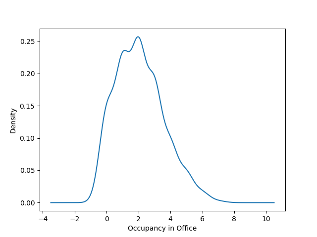

# Sensor Mini-Project 

Authors: McKenna Damschroder and Zongxin Cui

Date: 9/14/2020

## Responses

### Task 0:

What is the greeting string issued by the server to the client upon first connecting?

 - "ECE Senior Capstone IoT simulator""

### Task 1:

In this task, code was added to [src/sp_iotsim/client.py](https://github.com/zongxinc/2020-sensor-miniproject/blob/main/src/sp_iotsim/client.py) to save the JSON sensor data to a text file as it comes in. The resulting text file is named [data.txt](https://github.com/zongxinc/2020-sensor-miniproject/blob/main/data.txt).

### Task 2:

In this task, the Pandas library was used to do numerical analysis on the data set from Task 1. All analysis code can be found in [analysis.py](https://github.com/zongxinc/2020-sensor-miniproject/blob/main/analysis.py). The first three questions answered below involved analyzing sensor data for a specific room. The room that we chose to examine is the office.

1. What are the median and variance observed from the temperature data? 

 - Median: 23.018693542662476
 - Variance: 9.790063333923133

2. What are the median and variance observed from the occupancy data?

 - Median: 2.0
 - Variance: 2.2173377088504274

3. Plot the probability density functions for each sensor type.

Below are the graphed probability density functions. One again, this is solely for data taken from the office sensors. The plots below were created using Pandas's kde() function. This function generates Kernel Density Estimate (KDE) plots using Gaussian kernels. A KDE is way, in statistics, to estimate the probability density function. We also have created histogram plots for each data set and they can be found in the [images](https://github.com/zongxinc/2020-sensor-miniproject/tree/main/images) folder. 

What is the mean and variance of the time interval of the sensor readings?
 - Mean: 1.0368927617675312
 - Variance: 1.0847226416405662
 
Plot the probability distribution function for the time intervals.
NEED TO ADD (image in images folder)

Does it mimic a well-known distribution for connection intervals in large systems?
TO DO

Task 3:
We implemented an algorithm that checks if a temperature data point is further than 2 standard deviations away from the mean. The anomalies detected in our data set using this algorithm can be found in anomalies.txt.

See anomalies.txt for list of detected anomalies.

The percentage of all points that are bad points is 0.01729106628242075

The new median and variance with the bad points removed are:
- Median: 23.019330104257943
- Variance: 1.0823557009382205

Does a persistent change in temperature	always indicate a failed sensor?
What are possible bounds on temperature for each room type?

Task 4:
How is this simulation reflective of the real world?
How is this simulation deficient? What factors does it fail to account for?
How is the difficulty of initially using this Python websockets library as compared to a compiled language e.g. C++ websockets?
Would it be better to have the server poll the sensors, or the sensors reach out to the server when they have data?

